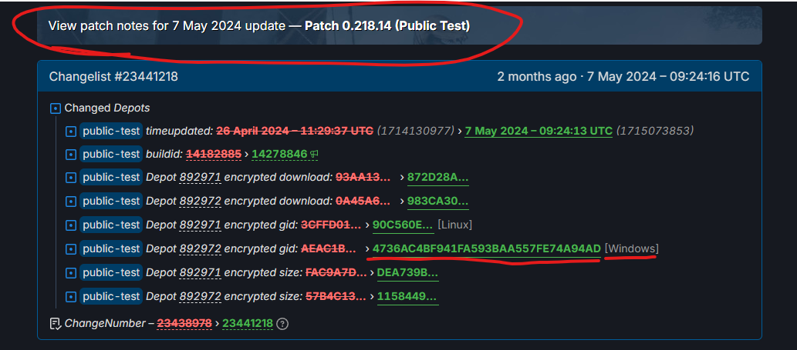

DepotDownloader
===============

Steam depot downloader utilizing the SteamKit2 library. Supports .NET 8.0

### Download Valheim public-test for Windows
```
DepotDownloader.exe -app 892970 -depot 892972 -emanifest <manifest_id_in_quotes>
    -beta public-test -betapassword "yesimadebackups" -dir <path_to_save_downloads>
    -username <steam_username> -remember-password -filelist <path_to_filelist.txt>
```

If you just want to download the .dlls for diffing or other purposes, use the -filelist parameter and point it to a text file that looks like this:
```
regex:^valheim_Data/Managed/.*$
```

An example of an encrypted manifest might be like: "4736AC4BF941FA593BAA557FE74A94AD".

You can find this ID by going to https://steamdb.info/app/892970/history/ and scrolling down to the patch that matches. For example, the above ID of "4736AC4BF941FA593BAA557FE74A94AD" is from:


For public builds (non-ptb) for Windows: https://steamdb.info/depot/892972/manifests/

Just pull the manifest ID out of there. Date should make it clear which update.

For PTB builds: https://steamdb.info/app/892970/history/

You can see which build turns into which build. Red text is the previous manifest ID, Green text is the current manifest ID. Obviously look at the "Windows" one. So using that you can kind of track down which build is which based on the date.

For example: `27EC567E4F7FAEE5AB208EB822FA4CD9` The green text for this is in Changelist #23532218 which was on May 14 2024.

This is the same day Ashlands dropped. When this gets decrypted, it is 6520771666346535649 which is the exact same manifest ID as the live version. AKA PTB == Live. So if you look at the previous one (the red text in the same line): `4736AC4BF941FA593BAA557FE74A94AD`

If you search for that with Ctrl + F, you find the previous Changelist which is on May 7th, which matches 0.218.14 PTB. This method can help you track down the order in which builds change, and then you can use my tool to get it.


### Downloading one or all depots for an app
```
dotnet DepotDownloader.dll -app <id> [-depot <id> [-manifest <id>]]
    [-username <username> [-password <password>]] [other options]
```

For example: `dotnet DepotDownloader.dll -app 730 -depot 731 -manifest 7617088375292372759`

### Downloading a workshop item using pubfile id
```
dotnet DepotDownloader.dll -app <id> -pubfile <id> [-username <username> [-password <password>]]
```

For example: `dotnet DepotDownloader.dll -app 730 -pubfile 1885082371`

### Downloading a workshop item using ugc id
```
dotnet DepotDownloader.dll -app <id> -ugc <id> [-username <username> [-password <password>]]
```

For example: `dotnet DepotDownloader.dll -app 730 -ugc 770604181014286929`

## Parameters

Parameter | Description
--------- | -----------
-app \<#>				| the AppID to download.
-depot \<#>				| the DepotID to download.
-manifest \<id>			| manifest id of content to download (requires -depot, default: current for branch).
-emanifest \<string_id> | encrypted manifest id of content to download (requires -depot ; is a string instead of an integer)
-ugc \<#>				| the UGC ID to download.
-beta \<branchname>		| download from specified branch if available (default: Public).
-betapassword \<pass>	| branch password if applicable.
-all-platforms			| downloads all platform-specific depots when -app is used.
-os \<os>				| the operating system for which to download the game (windows, macos or linux, default: OS the program is currently running on)
-osarch \<arch>			| the architecture for which to download the game (32 or 64, default: the host's architecture)
-all-languages			| download all language-specific depots when -app is used.
-language \<lang>		| the language for which to download the game (default: english)
-lowviolence			| download low violence depots when -app is used.
-pubfile \<#>			| the PublishedFileId to download. (Will automatically resolve to UGC id)
-username \<user>		| the username of the account to login to for restricted content.
-password \<pass>		| the password of the account to login to for restricted content.
-remember-password		| if set, remember the password for subsequent logins of this user. (Use -username <username> -remember-password as login credentials)
-dir \<installdir>		| the directory in which to place downloaded files.
-filelist \<file.txt>	| a list of files to download (from the manifest). Prefix file path with `regex:` if you want to match with regex.
-validate				| Include checksum verification of files already downloaded
-manifest-only			| downloads a human readable manifest for any depots that would be downloaded.
-cellid \<#>			| the overridden CellID of the content server to download from.
-max-servers \<#>		| maximum number of content servers to use. (default: 20).
-max-downloads \<#>		| maximum number of chunks to download concurrently. (default: 8).
-loginid \<#>			| a unique 32-bit integer Steam LogonID in decimal, required if running multiple instances of DepotDownloader concurrently.


## Frequently Asked Questions

### Why am I prompted to enter a 2-factor code every time I run the app?
Your 2-factor code authenticates a Steam session. You need to "remember" your session with `-remember-password` which persists the login key for your Steam session.

### Can I run DepotDownloader while an account is already connected to Steam?
Any connection to Steam will be closed if they share a LoginID. You can specify a different LoginID with `-loginid`.

### Why doesn't my password containing special characters work? Do I have to specify the password on the command line?
If you pass the `-password` parameter with a password that contains special characters, you will need to escape the command appropriately for the shell you are using. You do not have to include the `-password` parameter on the command line as long as you include a `-username`. You will be prompted to enter your password interactively.
